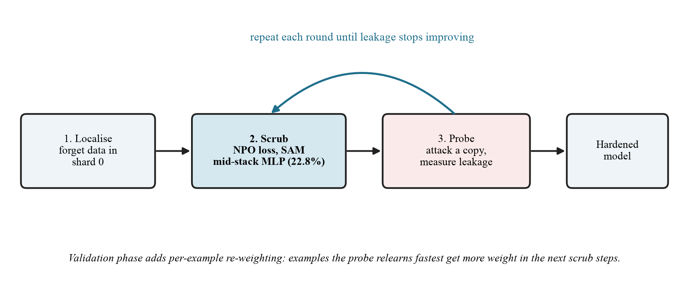

# HRU — Hybrid Retention-aware Unlearning

1. **Localise** — forget data lives in shard 0 (sharded variant) or the scrub runs on the whole model (unsharded).
2. **Scrub** — NPO loss on the forget set + language-model loss on the retain set, optimised with **Sharpness-Aware Minimization** (ρ = 0.05) on mid-stack MLP weights only (blocks 3–8, 22.8% of parameters). Flat minima are harder for a relearning fine-tune to escape.

   `L_NPO(θ) = (2/β) · E[ log(1 + (π_θ(y|x) / π_ref(y|x))^β) ]`, β = 0.1

3. **Harden** — after each 20-update round, attack a copy of the model on development probes and measure leakage; stop when it no longer improves (max 6 rounds = 120 updates).

**Validation phase** ([`notebooks/07_deciding_experiment.ipynb`](../notebooks/07_deciding_experiment.ipynb), [`src/hru_v5.py`](../src/hru_v5.py)): per-example re-weighting — every 5 steps, attack a clone and up-weight the examples it relearns fastest — compared against SAM-NPO at equal budget over 3 seeds with fact-level metrics. Origin of the mechanism: `_AttackHardener` in [`src/harness_v1/arms/hru.py`](../src/harness_v1/arms/hru.py).

## Results so far
| | Durability | Retain | Truth ratio |
|---|---|---|---|
| HRU (unsharded) | **−1.309** | −1.692 | 1.292 |
| HRU (sharded, k=4) | −0.420 | −0.444 | 1.059 |
| NPO | −0.762 | −1.594 | 13.166 |
| Full retrain | −0.582 | −0.236 | 1.007 |

Sharding dilutes the scrub: shard 0 alone −4.179 → −0.502 inside the 4-shard ensemble (logit averaging lets untouched shards outvote it).
