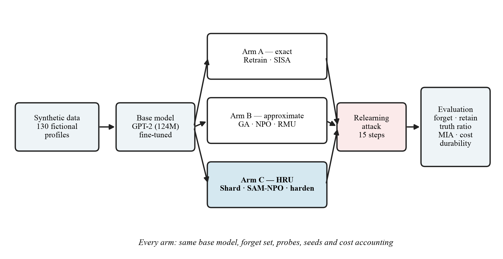

# Problem Statement

## Problem
Given a language model trained on data that includes facts to be forgotten, remove those facts at a cost far below full retraining such that:
1. the model no longer reproduces them,
2. its knowledge of all other data is preserved, and
3. the forgetting **persists** when an adversary fine-tunes the model on related data.

## Why it matters
- GDPR Art. 17 and India's DPDP Act §12 grant a right to erasure; deleting the database row does not remove what the model learned.
- Retraining per request is unaffordable; per-request methods must cost close to one fine-tuning pass.
- Approximate unlearning can be reversed in minutes by a relearning fine-tune.

## Dataset (synthetic, no real personal data)
| Attribute | Value |
|---|---|
| Fictional profiles | 130 (5 facts each → 650 Q&A pairs) |
| Forget / retain / holdout | 20 / 80 / 30 profiles |
| Attack probes | 80 paraphrases — 40 dev, 40 test |
| Distractors | 3 wrong answers per forget fact |

Generator: [`data/make_forget_set.py`](../data/make_forget_set.py).
